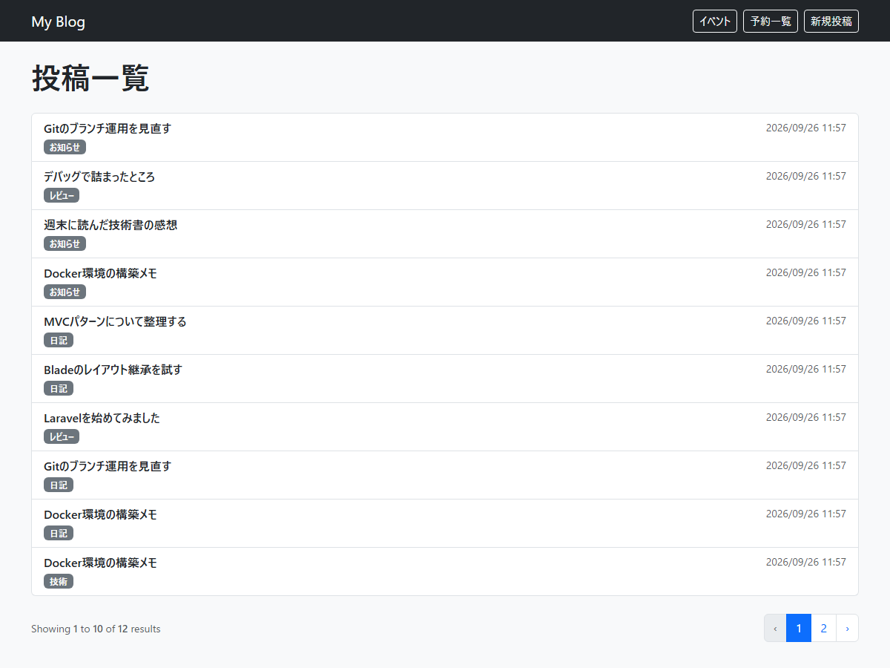
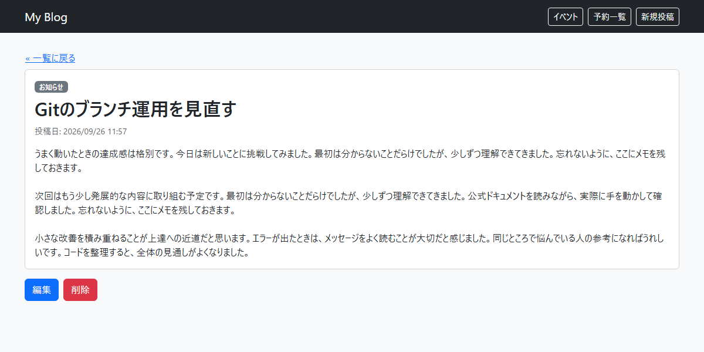
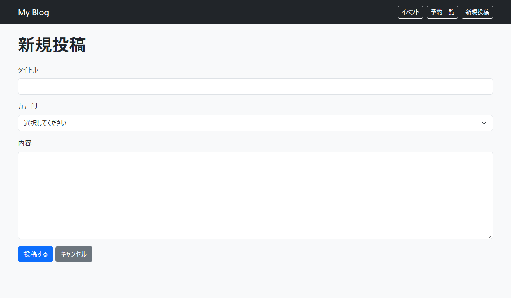

# Laravel Docker App

Docker Compose上のLaravel(MVC)で作成した、**ブログシステム**と**イベント予約システム**です。
両システムは同じアプリ・同じレイアウト(`layouts/app.blade.php`)上で動作し、画面上部のナビゲーションから行き来できます。

## 使用技術

- PHP / Laravel
- MySQL
- Nginx / phpMyAdmin
- Docker Compose
- Bootstrap 5(CDN)

## 機能説明

### ブログシステム

| 機能 | URL | 説明 |
| --- | --- | --- |
| 投稿一覧 | `/posts` | 新しい順に10件ずつ表示(ページネーション付き) |
| 投稿詳細 | `/posts/{id}` | タイトル・カテゴリー・本文・投稿日を表示 |
| 投稿作成 | `/posts/create` | タイトル・内容・カテゴリーを入力して投稿 |
| 投稿編集 | `/posts/{id}/edit` | 投稿内容を更新 |
| 投稿削除 | 詳細画面の「削除」 | 確認ダイアログの後に削除 |

- バリデーション: タイトルは必須・255文字以内、内容は必須、カテゴリーは必須かつ存在するもの。エラーは各入力欄の下に表示され、入力値は保持されます。
- Bladeレイアウト継承: すべての画面が `layouts/app.blade.php` を継承し、作成・編集フォームは `posts/_form.blade.php` を共通化しています。

### イベント予約システム

| 機能 | URL | 説明 |
| --- | --- | --- |
| イベント一覧 | `/events` | 開催日時順に表示。残席数も確認できます |
| イベント詳細 | `/events/{id}` | 場所・開催日時・残席・内容を表示。満席の場合は予約ボタンが無効になります |
| イベント作成 | `/events/create` | イベント名・場所・開催日時・定員・内容を入力して作成 |
| 予約作成 | `/events/{id}/reservations/create` | 名前・メールアドレス・人数・予約日時を入力して予約 |
| 予約一覧 | `/reservations` | 予約の状態(予約中 / キャンセル済み)を表示 |
| 予約のキャンセル | 予約一覧の「キャンセル」 | 確認ダイアログの後にキャンセル |

- バリデーション(予約): 名前は必須、メールアドレスは形式チェック、人数は1人以上かつ残席以下、予約日時は現在より後。
- バリデーション(イベント): すべて必須。開催日時は現在より後、定員は1以上。
- 残席の計算: `定員 - 有効な予約の合計人数`。キャンセル済みの予約は含めません。
- キャンセル: 予約を削除せず、`cancelled_at` に日時を記録します。

## テーブル定義

### categories(カテゴリー)

| カラム | 型 | NULL | 説明 |
| --- | --- | --- | --- |
| id | bigint unsigned | NO | 主キー |
| name | varchar(255) | NO | カテゴリー名 |
| created_at | timestamp | YES | 作成日時 |
| updated_at | timestamp | YES | 更新日時 |

### posts(投稿)

| カラム | 型 | NULL | 説明 |
| --- | --- | --- | --- |
| id | bigint unsigned | NO | 主キー |
| category_id | bigint unsigned | NO | 外部キー(categories.id)。カテゴリー削除時は投稿も削除 |
| title | varchar(255) | NO | タイトル |
| content | text | NO | 内容 |
| created_at | timestamp | YES | 作成日時 |
| updated_at | timestamp | YES | 更新日時 |

### events(イベント)

| カラム | 型 | NULL | 説明 |
| --- | --- | --- | --- |
| id | bigint unsigned | NO | 主キー |
| title | varchar(255) | NO | イベント名 |
| description | text | NO | 内容 |
| location | varchar(255) | NO | 場所 |
| starts_at | datetime | NO | 開催日時 |
| capacity | int unsigned | NO | 定員 |
| created_at | timestamp | YES | 作成日時 |
| updated_at | timestamp | YES | 更新日時 |

### reservations(予約)

| カラム | 型 | NULL | 説明 |
| --- | --- | --- | --- |
| id | bigint unsigned | NO | 主キー |
| event_id | bigint unsigned | NO | 外部キー(events.id)。イベント削除時は予約も削除 |
| name | varchar(255) | NO | 予約者名 |
| email | varchar(255) | NO | メールアドレス |
| guests | int unsigned | NO | 人数 |
| reserved_at | datetime | NO | 予約日時 |
| cancelled_at | timestamp | YES | キャンセル日時(NULLなら有効な予約) |
| created_at | timestamp | YES | 作成日時 |
| updated_at | timestamp | YES | 更新日時 |

### リレーション

```
categories 1 ── * posts
events     1 ── * reservations
```

## スクリーンショット

### ブログシステム

| 投稿一覧(ページネーション付き) | 投稿詳細 |
| --- | --- |
|  |  |

| 投稿作成 |
| --- |
|  |

### イベント予約システム

| イベント一覧 | イベント詳細 |
| --- | --- |
|  |  |

| 予約作成 | 予約一覧(キャンセル済みを含む) |
| --- | --- |
|  |  |

## ディレクトリ構成(主要部分)

```
src/
├── app/
│   ├── Http/
│   │   ├── Controllers/   PostController, EventController, ReservationController
│   │   └── Requests/      StorePostRequest, UpdatePostRequest, StoreEventRequest, StoreReservationRequest
│   └── Models/            Post, Category, Event, Reservation
├── database/
│   ├── migrations/        categories, posts, events, reservations
│   ├── factories/
│   └── seeders/           CategorySeeder, EventSeeder
├── resources/views/
│   ├── layouts/app.blade.php
│   ├── posts/
│   ├── events/
│   └── reservations/
└── routes/web.php
```

## 環境構築

1. コンテナの起動
docker compose up -d

2. Laravelのインストール
docker compose exec app bash
→コンテナ内のLinuxターミナルが開く
composer create-project laravel/laravel .
→Laravelのインストールを実行するコマンド
chown -R www-data:www-data storage bootstrap/cache
chmod -R 775 storage bootstrap/cache
→権限の設定。Laravelがログファイル等を書き込めるようにする
exit
→コンテナから出る

3. .envのDB設定の編集
　DB_CONNECTION=mysql
　DB_HOST=db
　DB_PORT=3306
　DB_DATABASE=laravel
　DB_USERNAME=root
　DB_PASSWORD=secret

4. マイグレーションと初期データの投入
docker compose exec app php artisan migrate --seed
→カテゴリー4件(お知らせ・技術・日記・レビュー)とイベント3件(グッズ先行販売)が登録されます

5. 動作確認
 Laravel: http://localhost
 phpMyAdmin: http://localhost:8080（サーバ: `db`）
