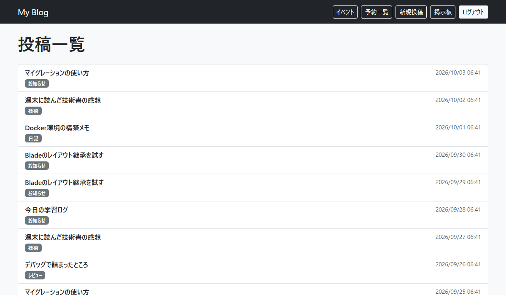
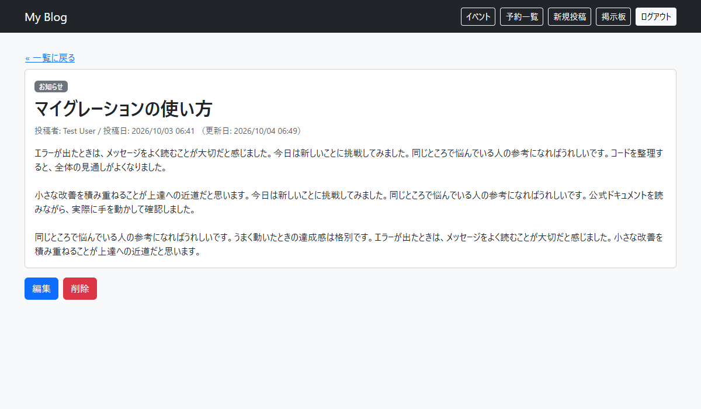
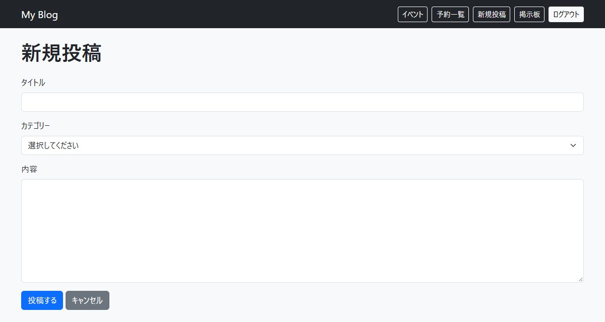
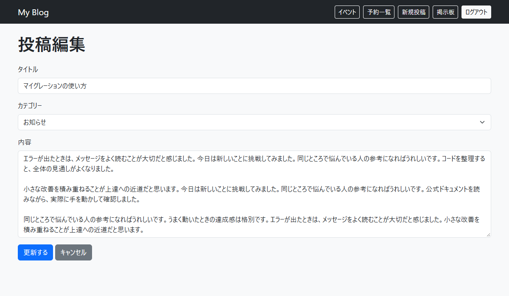
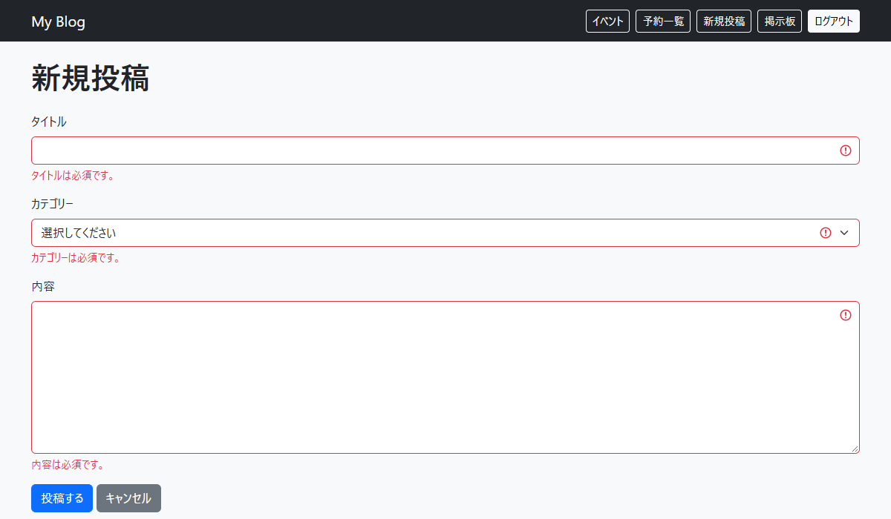
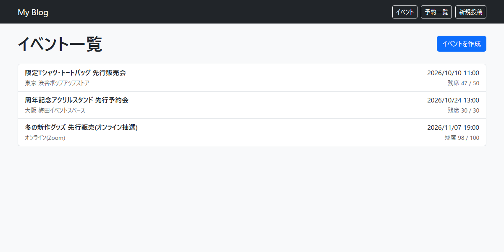
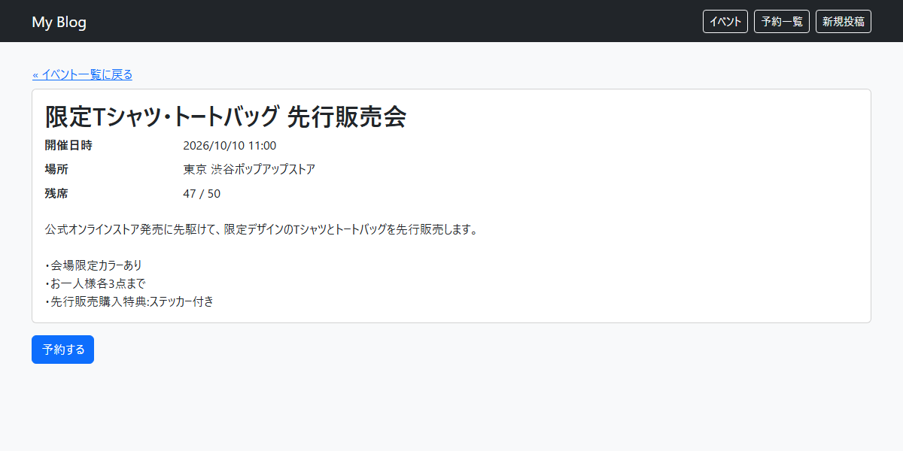
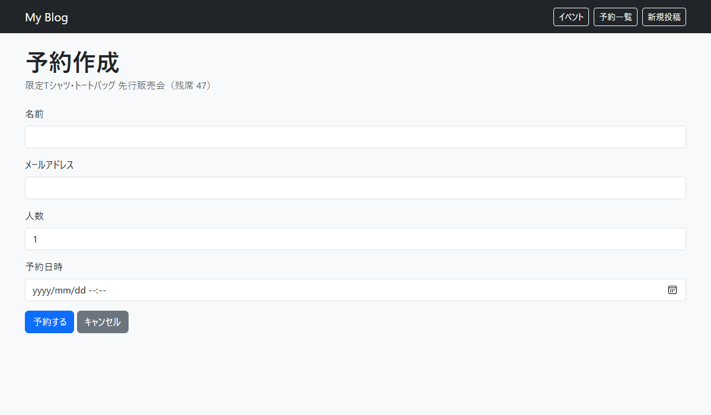
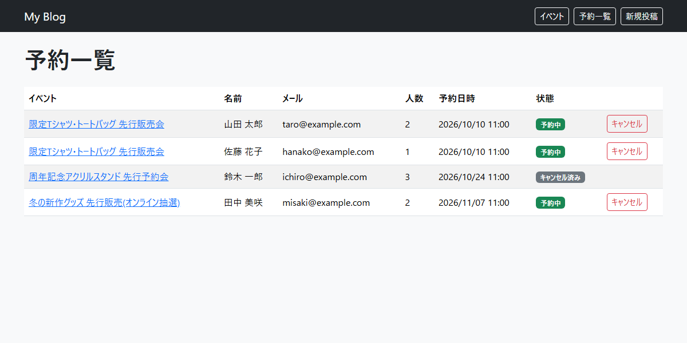

# Laravel Docker App

Docker Compose上のLaravel(MVC)で作成した学習用アプリです。
**ログイン機能付き掲示板**のほか、**ブログシステム**と**イベント予約システム**を含みます。

## 使用技術

- PHP 8.2 / Laravel 12
- Laravel Breeze(ユーザー登録・ログイン)
- MySQL 8.0
- Nginx / phpMyAdmin
- Docker Compose
- Tailwind CSS / Vite(Breeze の画面・掲示板)
- Bootstrap 5(CDN、ブログ・イベント予約の画面)

## 機能一覧

| 機能 | URL | ログイン |
| --- | --- | --- |
| ユーザー登録 | `/register` | 不要 |
| ログイン / ログアウト | `/login` / ナビゲーションのメニュー | 不要 |
| パスワードリセット | `/forgot-password` | 不要 |
| ダッシュボード | `/dashboard` | 必要 |
| プロフィール編集・退会 | `/profile` | 必要 |
| 掲示板の閲覧 | `/comments` | 不要 |
| 掲示板への投稿 | `/comments` の投稿フォーム | 必要 |
| 掲示板の投稿削除 | 各投稿の「削除」 | 必要(投稿者本人のみ) |
| ブログの閲覧・投稿 | `/posts` | 必要 |
| ブログの編集・削除 | 投稿詳細の「編集」「削除」 | 必要(投稿者本人のみ) |
| イベント・予約 | `/events`、`/reservations` | 不要 |

バリデーションエラーや Breeze の画面の文言は日本語で表示されます(`APP_LOCALE=ja`、翻訳は `src/lang/ja` と `src/lang/ja.json`)。

## 機能説明

### 認証(Laravel Breeze)

- ユーザー登録・ログイン・ログアウト・パスワードリセット・プロフィール編集・退会。
- ログインは同じメールアドレス + IP からの失敗が5回でロックされます。
- ログイン・ログアウト時にセッション ID を再生成します。
- 未ログインでログイン必須の画面を開くと `/login` にリダイレクトされます。

### 掲示板

| 機能 | URL | 説明 |
| --- | --- | --- |
| 投稿一覧 | `GET /comments` | 新しい順に20件ずつ表示。投稿者名と投稿日時を表示。誰でも閲覧可 |
| 投稿 | `POST /comments` | ログインユーザーのみ。未ログイン時はフォームの代わりにログイン・登録への案内を表示 |
| 削除 | `DELETE /comments/{id}` | 投稿者本人のみ。削除ボタンも本人にだけ表示。他人が削除しようとすると 403 |

- バリデーション: 本文は必須・1000文字以内。
- 投稿者(`user_id`)はリクエストの値ではなく、ログイン中のユーザーから設定します。
- 連投制限: 1ユーザーにつき1分間に10件まで(超えると 429)。
- 削除の権限は `app/Policies/CommentPolicy.php` で判定します。
- セキュリティテストの結果は [docs/security-report.md](docs/security-report.md) を参照してください。

### ブログシステム

| 機能 | URL | 説明 |
| --- | --- | --- |
| 投稿一覧 | `/posts` | 新しい順に10件ずつ表示(ページネーション付き) |
| 投稿詳細 | `/posts/{id}` | タイトル・カテゴリー・投稿者・本文・投稿日を表示 |
| 投稿作成 | `/posts/create` | タイトル・内容・カテゴリーを入力して投稿 |
| 投稿編集 | `/posts/{id}/edit` | 投稿内容を更新(投稿者本人のみ) |
| 投稿削除 | 詳細画面の「削除」 | 確認ダイアログの後に削除(投稿者本人のみ) |

- すべての画面でログインが必要です。
- 投稿者(`user_id`)はログイン中のユーザーから設定します。編集・削除の権限は `app/Policies/PostPolicy.php` で判定し、ボタンも投稿者本人にだけ表示します。他人が操作しようとすると 403 になります。
- バリデーション: タイトルは必須・255文字以内、内容は必須、カテゴリーは必須かつ存在するもの。作成・更新で共通の `PostRequest` を使います。エラーは各入力欄の下に日本語で表示され、入力値は保持されます。
- Bladeレイアウト継承: ブログとイベント予約の画面は `layouts/blog.blade.php`(Bootstrap)を継承し、作成・編集フォームは `posts/_form.blade.php` を共通化しています。認証と掲示板の画面は Breeze の `layouts/app.blade.php`(Tailwind CSS)を使います。

### イベント予約システム

| 機能 | URL | 説明 |
| --- | --- | --- |
| イベント一覧 | `/events` | 開催日時順に表示。残席数も確認できます |
| イベント詳細 | `/events/{id}` | 場所・開催日時・残席・内容を表示。満席の場合は予約ボタンが無効になります |
| イベント作成 | `/events/create` | イベント名・場所・開催日時・定員・内容を入力して作成 |
| 予約作成 | `/events/{id}/reservations/create` | 名前・メールアドレス・人数・予約日時を入力して予約 |
| 予約一覧 | `/reservations` | 予約の状態(予約中 / キャンセル済み)を表示 |
| 予約のキャンセル | 予約一覧の「キャンセル」 | 確認ダイアログの後にキャンセル |

- バリデーション(予約): 名前は必須、メールアドレスは形式チェック、人数は1人以上かつ残席以下、予約日時は現在より後。
- バリデーション(イベント): すべて必須。開催日時は現在より後、定員は1以上。
- 残席の計算: `定員 - 有効な予約の合計人数`。キャンセル済みの予約は含めません。
- キャンセル: 予約を削除せず、`cancelled_at` に日時を記録します。

## テーブル定義

Breeze 標準の `users`、`sessions`、`password_reset_tokens` などは省略しています。

### comments(掲示板の投稿)

| カラム | 型 | NULL | 説明 |
| --- | --- | --- | --- |
| id | bigint unsigned | NO | 主キー |
| user_id | bigint unsigned | NO | 外部キー(users.id)。ユーザー削除時は投稿も削除 |
| body | text | NO | 本文 |
| created_at | timestamp | YES | 作成日時 |
| updated_at | timestamp | YES | 更新日時 |

### categories(カテゴリー)

| カラム | 型 | NULL | 説明 |
| --- | --- | --- | --- |
| id | bigint unsigned | NO | 主キー |
| name | varchar(255) | NO | カテゴリー名 |
| created_at | timestamp | YES | 作成日時 |
| updated_at | timestamp | YES | 更新日時 |

### posts(投稿)

| カラム | 型 | NULL | 説明 |
| --- | --- | --- | --- |
| id | bigint unsigned | NO | 主キー |
| user_id | bigint unsigned | YES | 外部キー(users.id)。投稿者。ユーザー削除時は投稿も削除。カラム追加前の投稿は NULL(誰も編集・削除できない) |
| category_id | bigint unsigned | NO | 外部キー(categories.id)。カテゴリー削除時は投稿も削除 |
| title | varchar(255) | NO | タイトル |
| content | text | NO | 内容 |
| created_at | timestamp | YES | 作成日時 |
| updated_at | timestamp | YES | 更新日時 |

### events(イベント)

| カラム | 型 | NULL | 説明 |
| --- | --- | --- | --- |
| id | bigint unsigned | NO | 主キー |
| title | varchar(255) | NO | イベント名 |
| description | text | NO | 内容 |
| location | varchar(255) | NO | 場所 |
| starts_at | datetime | NO | 開催日時 |
| capacity | int unsigned | NO | 定員 |
| created_at | timestamp | YES | 作成日時 |
| updated_at | timestamp | YES | 更新日時 |

### reservations(予約)

| カラム | 型 | NULL | 説明 |
| --- | --- | --- | --- |
| id | bigint unsigned | NO | 主キー |
| event_id | bigint unsigned | NO | 外部キー(events.id)。イベント削除時は予約も削除 |
| name | varchar(255) | NO | 予約者名 |
| email | varchar(255) | NO | メールアドレス |
| guests | int unsigned | NO | 人数 |
| reserved_at | datetime | NO | 予約日時 |
| cancelled_at | timestamp | YES | キャンセル日時(NULLなら有効な予約) |
| created_at | timestamp | YES | 作成日時 |
| updated_at | timestamp | YES | 更新日時 |

### リレーション

```
users      1 ── * comments
users      1 ── * posts
categories 1 ── * posts
events     1 ── * reservations
```

## スクリーンショット

### ブログシステム

| 投稿一覧 | 投稿詳細 |
| --- | --- |
|  |  |

| 投稿作成 | 投稿編集 |
| --- | --- |
|  |  |

| 投稿作成(バリデーションエラー) |
| --- |
|  |

### イベント予約システム

| イベント一覧 | イベント詳細 |
| --- | --- |
|  |  |

| 予約作成 | 予約一覧(キャンセル済みを含む) |
| --- | --- |
|  |  |

## ディレクトリ構成(主要部分)

```
src/
├── app/
│   ├── Http/
│   │   ├── Controllers/   CommentController, PostController, EventController, ReservationController,
│   │   │                  ProfileController, Auth/(Breeze)
│   │   └── Requests/      PostRequest, StoreEventRequest, StoreReservationRequest
│   ├── Models/            User, Comment, Post, Category, Event, Reservation
│   └── Policies/          CommentPolicy, PostPolicy
├── database/
│   ├── migrations/        users, comments, categories, posts, events, reservations
│   ├── factories/
│   └── seeders/           DatabaseSeeder, CategorySeeder, EventSeeder
├── lang/                  ja/(バリデーション等の日本語訳), ja.json(Breeze 画面の日本語訳)
├── resources/views/
│   ├── layouts/           app(Breeze), guest, navigation, blog(ブログ・イベント予約用)
│   ├── auth/              ログイン・登録など(Breeze)
│   ├── comments/          掲示板
│   ├── posts/
│   ├── events/
│   └── reservations/
├── routes/
│   ├── web.php
│   └── auth.php           認証関連のルート(Breeze)
└── tests/Feature/         CommentTest, PostTest など
```

## 環境構築(clone した人向け)

Laravel 本体はこのリポジトリの `src/` に含まれているため、`composer create-project` は不要です。
事前に以下をインストールしてください。

- Docker Desktop(Docker Compose)
- Node.js 20.19 以上(画面の CSS / JS のビルドに使用。PHP コンテナには Node.js が入っていないため、ホスト側で実行します)

### 1. リポジトリの取得

```bash
git clone https://github.com/remi-code-dev/techmeets-month2.git
cd techmeets-month2
```

### 2. Docker 用の環境変数ファイルを作成

```bash
cp .env.example .env
```

`docker-compose.yml` が読み込む設定です。ポート番号やDBパスワードは必要に応じて `.env` で変更できます。

| 変数 | 既定値 | 説明 |
| --- | --- | --- |
| `NGINX_PORT` | 80 | Laravel にアクセスするポート |
| `DB_PORT` | 3306 | MySQL に公開するポート |
| `PMA_PORT` | 8080 | phpMyAdmin にアクセスするポート |
| `DB_PASSWORD` | secret | MySQL の root パスワード(`docker-compose.yml` の3か所で共通利用) |

### 3. コンテナの起動

```bash
docker compose up -d --build
```

### 4. Laravel のセットアップ

```bash
# Laravel 用の .env を作成(DB設定は MySQL 用になっています)
cp src/.env.example src/.env

# 依存パッケージのインストール
docker compose exec app composer install

# アプリケーションキーの生成
docker compose exec app php artisan key:generate

# 権限の設定(Laravel がログ等を書き込めるようにする)
docker compose exec app chown -R www-data:www-data storage bootstrap/cache
docker compose exec app chmod -R 775 storage bootstrap/cache

# マイグレーションと初期データの投入
docker compose exec app php artisan migrate --seed
```

`.env` の `DB_PASSWORD` を変更した場合は、`src/.env` の `DB_PASSWORD` も同じ値にしてください。

すでに環境を作ってある場合は、`git pull` の後に以下を実行してください。

- `docker compose exec app php artisan migrate`(`posts.user_id` の追加)
- `src/.env` の `APP_LOCALE` を `ja` に変更(エラーメッセージの日本語化)

`user_id` を追加する前に作った投稿は投稿者が NULL になり、誰も編集・削除できません。不要であれば `docker compose exec app php artisan migrate:fresh --seed` で作り直してください(**DB のデータはすべて消えます**)。

初期データとして、以下が登録されます。

- テストユーザー1件(メール: `test@example.com`、パスワード: `password`)
- カテゴリー4件(お知らせ・技術・日記・レビュー)
- イベント3件(グッズ先行販売)

### 5. フロントエンドのビルド

`public/build` は Git の管理対象外なので、clone 後に一度ビルドが必要です。ビルドしないと画面表示時に `Vite manifest not found` エラーになります。

```bash
cd src
npm install
npm run build
cd ..
```

開発中に CSS / Blade を変更しながら確認する場合は、`npm run build` の代わりに `npm run dev` を起動したままにします。

### 6. 動作確認

- Laravel: http://localhost(`NGINX_PORT` を変えた場合は `http://localhost:{NGINX_PORT}`)
  - 掲示板: http://localhost/comments
  - ログイン: http://localhost/login(上記のテストユーザー、または `/register` で登録したユーザー)
- phpMyAdmin: http://localhost:8080(サーバ: `db`、ユーザー: `root`)

パスワードリセットのメールは送信されず、`MAIL_MAILER=log` により `src/storage/logs/laravel.log` に出力されます。

### 7. テストの実行

```bash
docker compose exec app php artisan test
```

テストは SQLite のインメモリ DB で実行されるため、MySQL のデータには影響しません。
